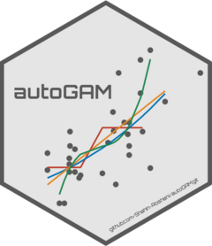

```{r, include = FALSE}
knitr::opts_chunk$set(
  collapse = TRUE,
  comment = "#>",
  fig.path = "man/figures/README-",
  out.width = "100%"
)
```

# autoGAM

<!-- badges: start -->
[](https://github.com/Shahin-Roshani/autoGAM/actions)

[](https://www.codefactor.io/repository/github/Shahin-Roshani/autoGAM)
[](https://codecov.io/gh/Shahin-Roshani/autoGAM)

[](https://lifecycle.r-lib.org/articles/stages.html#maturing)
[](https://github.com/Shahin-Roshani/autoGAM/commits/master)

[](https://github.com/Shahin-Roshani/autoGAM)
[](https://cran.r-project.org/web/licenses/MIT)
[](https://github.com/Shahin-Roshani/autoGAM)
<!-- badges: end -->

The goal of autoGAM is to automate the evaluation process of different forms of predictors and create the best Generalized Additive Model (GAM) by using workflow based procedures.

## Installation

You can install the released version of autoGAM (Version: 1.0.1) from [github](https://github.com/) with:

``` r
install.packages('devtools') #If you haven't installed it yet!

devtools::install_github('Shahin-Roshani/autoGAM')
```

## Related links:

[Repository in github](https://github.com/Shahin-Roshani/autoGAM)

[Package website for autoGAM](https://shahin-roshani.github.io/autoGAM/)

[Comprehensive vignette](https://shahin-roshani.github.io/autoGAM/articles/autoGAM.html)

[RPubs article](https://rpubs.com/ShahinRoshani/autoGAM)
